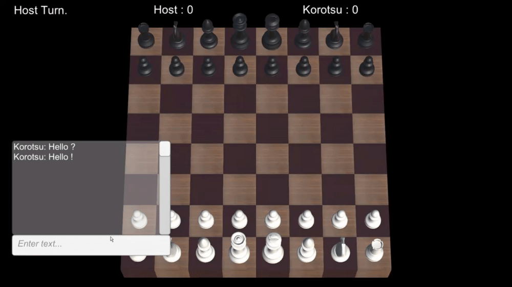

# ChessOnline

## Documents
[Credits](./Credits.txt)


## Getting started

1. Clone this repository with:
```batch
git clone ssh://git@git.isartintra.com:2424/2021/GP_2023_CHESSMULTI/Groupe_04.git
```
2. Go to BIN/GOLD and launch ChessGame.exe to start the game.
3. Or add the project to your unity Hub and open the editor and then hit the play button.


## Controls, features

| Key    | Action              |
|--------|---------------------|
| Esc    | Exit the program    |
| Return | Send a chat message |
| T      | Open/Close chat     |

the other controls are mouse buttons and movement;





